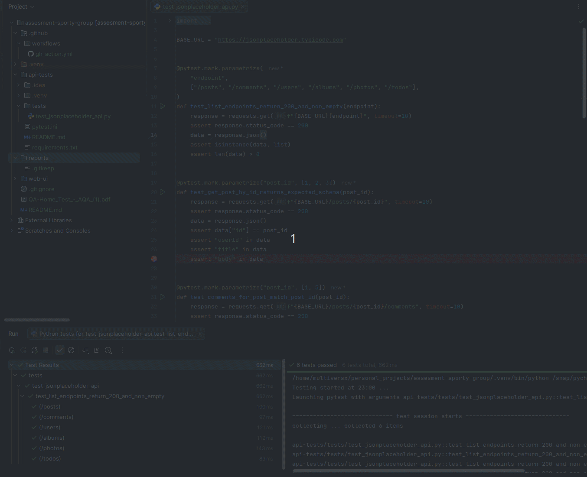

# Sporty Group - QA Home Test

This repository contains the QA home test for Sporty Group, which includes two separate test suites:
1.  **API Tests**: A suite for testing the JSONPlaceholder API.
2.  **Web UI Tests**: A suite for testing the Twitch mobile website using Selenium with Chrome emulation.

## 1. API Tests (`api-tests/`)

This suite uses `pytest` and `requests` to test the JSONPlaceholder API.

https://jsonplaceholder.typicode.com/



### Features
- Tests for creating, retrieving, updating, and deleting posts.
- Validates response status codes, headers, and JSON body content.
- Clear and maintainable test structure.

## 2. Web UI Tests (`web_ui/`)

This suite uses `pytest` and `Selenium` to automate the Twitch mobile web flow in Chrome emulation. The primary test flow is:

1.  Open the Twitch homepage.
2.  Navigate to the search page by clicking the "Browse" icon.
3.  Search for "StarCraft II".
4.  Select the "StarCraft II" category from the suggestions.
5.  Scroll down the results page.
6.  Select the first available streamer.
7.  Wait for the streamer's page to load and save a screenshot.


### Features
- **Page Object Model (POM)**: For clean, maintainable, and scalable tests.
- **Cross-Device Testing**: Parameterized to run on both "Pixel 7" and "iPhone 14 Pro Max" by default.
- **Robust Selectors**: Uses stable, test-specific `data-a-target` attributes where possible.
- **Advanced Modal Handling**: Automatically detects and closes consent pop-ups and other modals.
- **GitHub Actions Integration**: Fully automated testing, reporting, and artifact management.

---

## Setup and Installation

### Prerequisites
- Python 3.10+
- Google Chrome (for Web UI tests)

### Installation
1.  **Clone the repository:**
    ```bash
    git clone <repository-url>
    cd assesment-sporty-group
    ```

2.  **Create and activate a virtual environment:**
    ```bash
    python3 -m venv .venv
    source .venv/bin/activate
    ```

3.  **Install all dependencies:**
    This single command installs requirements for both API and Web UI tests.
    ```bash
    pip install -r api-tests/requirements.txt -r web_ui/requirements.txt
    ```

---

## Running Tests Locally

You can run all tests at once or run the suites individually.

- **Run all tests:**
  ```bash
  pytest
  ```

- **Run only API tests:**
  ```bash
  pytest api-tests/
  ```

- **Run only Web UI tests:**
  ```bash
  pytest web_ui/
  ```

### Web UI Test Configuration
You can control the Web UI tests using environment variables:
- `HEADLESS=true`: Run tests in headless mode (no visible browser).
- `MOBILE_DEVICE_NAME="<device_name>"`: Override the default parameterized devices and run on a single specific device (e.g., `"Pixel 7"`).

**Example:**
```bash
HEADLESS=true pytest web_ui/
```

---

## Test Reporting

This project uses `pytest-html` to generate detailed, self-contained HTML reports.

### Generating Local Reports
To generate a report in the `reports/` directory, run `pytest` with the `--html` flag.

- **Generate API test report:**
  ```bash
  pytest api-tests/ --html=reports/api-test-report.html --self-contained-html
  ```

- **Generate Web UI test report:**
  ```bash
  pytest web_ui/ --html=reports/web-ui-test-report.html --self-contained-html
  ```

After running, you can open the generated `.html` file from the `reports/` directory in your browser to view the results.

---

## Continuous Integration (CI)

This project uses **GitHub Actions** for automated testing. The workflow is defined in `.github/workflows/ci.yml`.

### CI Features
- **Automatic Triggers**: The workflow runs on every `push` or `pull_request` to the `main` branch.
- **Automated Setup**: Automatically installs Python, Google Chrome, and all dependencies.
- **Separate Test Execution**: Runs API and Web UI tests in separate steps.
- **Artifact Management**:
  - **Test Reports**: Automatically uploads the HTML reports for both suites on every run.
  - **Screenshots**: If any Web UI test fails, the corresponding screenshots are uploaded to help with debugging.

You can view the workflow runs, reports, and artifacts under the "Actions" tab of the GitHub repository.
